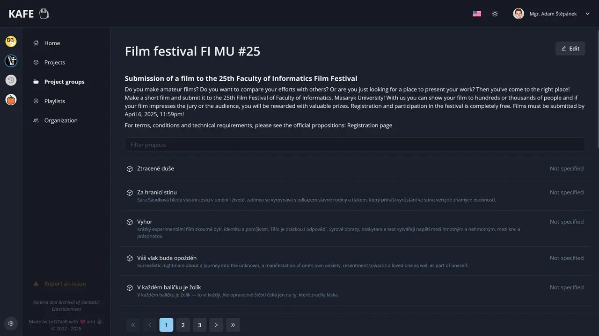
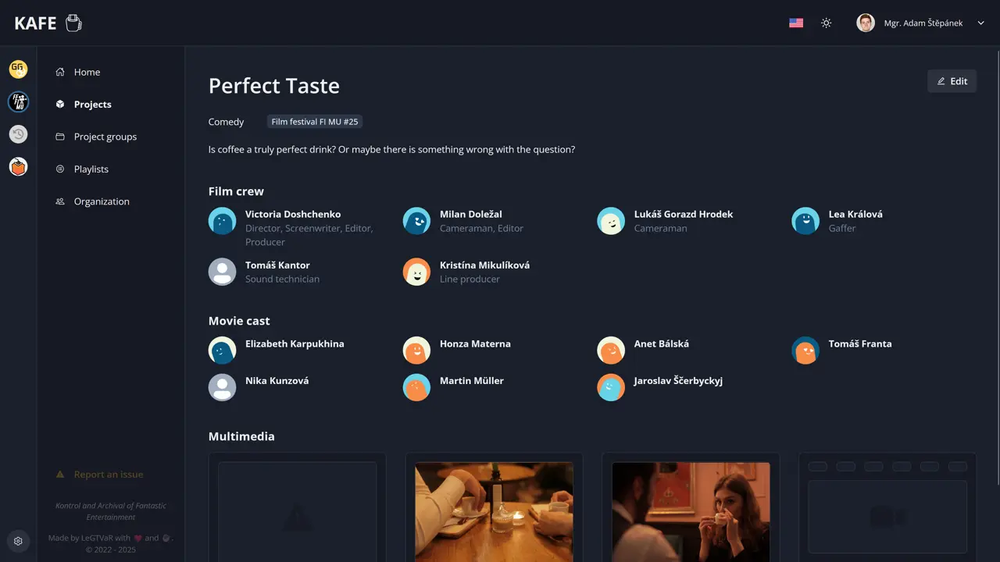

# KAFE

> _**K**ontrol and **A**rchival of **F**antastic **E**ntertainment_

KAFE is an archival system initially built for the Film festival of FI MU.
However, its abstractions were designed to be used for a variety of data.
KAFE can be thus extended for, for example, games, 3D models, photographs, generative design experiments, or whatever your heart desires.

> KAFE was developed with financial help from the Faculty of Informatics of MU as projects [`MUNI/33/0776/2021`](https://www.muni.cz/en/research/projects/67938) and [`MUNI/33/0026/2024`](https://www.muni.cz/en/research/projects/71853).

## Screenshots

## Attribution / External Dependencies

### Backend

- [PostgreSQL](https://www.postgresql.org/) -- the underlying database.
- [Marten](https://martendb.io/) -- event sourcing built on Postgres.
- [FFmpeg](https://ffmpeg.org/) -- for analysis and conversion of video.
- [FFMpegCore](https://github.com/rosenbjerg/FFMpegCore) -- C# wrapper around FFmpeg args.
- [MailKit](https://github.com/jstedfast/MailKit/) -- for saner email handling.
- ...and many more (see `*.csproj` files).

### Frontend

- [React](https://react.dev/)
- [Chakra UI](https://chakra-ui.com/)
- ...and many more (see `package.json` files).

## License

KAFE is licensed under [BSD-3-Clause](./LICENSE).

Please note, that the ImageSharp dependency is dual-licensed. If you plan to use KAFE commercially or continue its development in a closed-source fashion, you have to replace it or buy its [commercial license](https://sixlabors.com/pricing/).
